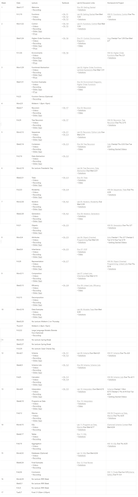

## CS 61A - Spring 2024

Update: 2024--06--20

This is my repository for lab, homeworks and project when going through the course, CS 61A, Spring 2024, from U.C. Berkeley.
Since the course page change to summar 2024. Some of halfway learners have to stop learning for unable to access to the spring 2024 website.
Hope this repository will help you.

> **Warning**
> This repository contains codes for tasks of CS 61A, so please be careful about not viloating the course's policies and not copy-pasting these codes.

## Overview

The CS 61 series is an introduction to computer science, with particular emphasis on software and on machines from a programmer's point of view.

1. CS 61A concentrates on the idea of abstraction, allowing the programmer to think in terms appropriate to the problem rather than in low-level operations dictated by the computer hardware.
2. CS 61B deals with the more advanced engineering aspects of software, such as constructing and analyzing large programs.
3. CS 61C focuses on machines and how they execute programs.

In CS 61A, we are interested in teaching you about programming, not about how to use one particular programming language. We consider a series of techniques for controlling program complexity, such as functional programming, data abstraction, and object-oriented programming.

CS 61A primarily uses the Python 3 programming language. Python is a popular language in both industry and academia. It is also particularly well-suited to the task of exploring the topics taught in this course. It is an open-source language developed by a large volunteer community that prides itself on the diversity of its contributors. We will also dive deeper into interpreters, to which end we'll introduce the Scheme programming language as a way to explore functional programming, and Regular Expressoins and the SQL programming language as a way to explore declarative programming.

Mastery of a particular programming language is a very useful side effect of CS 61A. However, our goal is not to dictate what language you use in your future endeavors. Instead, our hope is that once you have learned the concepts involved in programming, you will find that picking up a new programming language is but a few days' work.

## Contents

### Homeworks

- [Homework 1: Functions, Control](./hw/hw01/)
    
- [Homework 2: Higher Order Functions](./hw/hw02/)
    
- [Homework 3: Recursion, Tree Recursion](./hw/hw03/)
   
- [Homework 4: Sequences, ADT Trees](./hw/hw04/)
    
- [Homework 5: Generators](./hw/hw05/)
    
- [Homework 6: OOP, Linked Lists](./hw/hw06/)
   
- [Homework 7: Scheme](./hw/hw07/)
   
- [Homework 8: Scheme Lists](./hw/hw08/)

- [Homework 9: Programs as Data, Macros](./hw/hw09/)
- [Homework 10: SQL](./hw/hw10/)
- [Homework 11: Finale](./hw/hw11/)

### lab

- [Lab 0: Getting Started](./lab/lab00/)
    
- [Lab 1: Functions, Control](./lab/lab01/)
    
- [Lab 2: Higher-Order Functions, Lambda Expressions](./lab/lab02/)

- [Lab 3: Recursion, Python Lists](./lab/lab03/)

- [Lab 4: Tree Recursion, Data Abstraction](./lab/lab04/)
    
- [Lab 5: Mutability, Iterators](./lab/lab05/)
    
- [Lab 6: Object-Oriented Programming](./lab/lab06/)
   
- [Lab 7: Inheritance, Linked Lists](./lab/lab07/)
    
- [Lab 8: Mutable Trees](./lab/lab08/)

- [Lab 9: Scheme](./lab/lab09/)
    
- [Lab 10: Interpreters](./lab/lab10/)
    
- [Lab 11: Programs as Data, Macros](./lab/lab11/)
    
- [Lab 12: SQL](./lab/lab12/)

### discussion
- [disc 0: Getting Started](./disc/disc00/)
    
- [disc 1: Control, Environment Diagrams](./disc/disc01/)
    
- [disc 2: Environment Diagrams, Higher-Order Functions](./disc/disc02/)

- [disc 3: Recursion](./disc/disc03/)

- [disc 4: Tree Recursion](./disc/disc04/)
    
- [disc 5: Trees](./disc/disc05/)
    
- [disc 6: Iterators, Generators](./disc/disc06/)
   
- [disc 7: OOP](./disc/disc07/)
    
- [disc 8: Linked Lists, Efficiency](./disc/disc08/)

- [disc 9:  Scheme, Scheme Lists](./disc/disc09/)
    
- [disc 10: Interpreters](./disc/disc10/)
    
- [disc 11: SQL](./disc/disc11/)
    
- [disc 12: Final Review](./disc/disc12/)

    
### project

- [Project 1: The Game of Hog](./project/project1/)
   
- [Project 2: Cats](./project/project2/)
    
- [Project 3: Ants Vs. SomeBees](./project/project3/)
   
- [Project 4: Scheme Interpreter](./project/project4/)
   
- [Project 5: Optional Contest: Scheme Art](./project/project5/)

## Schedule

## Links

- [Course Website (2024 Summar)](https://cs61a.org/)
- [spring 2022 lab-hw-project](https://github.com/caiscoding/CS61A-Spring2022)
- [Vanshaj's Guide (Summer 2020)](https://cs61a.vanshaj.dev/welcome/)
- [Textbook (SICP for python)](http://composingprograms.com/)
- [Online editor (support scheme, SQL and python)](https://code.cs61a.org/)

## Reference
The most of resource of this repository from CS61A Spring 2024 homepage. However, the course page change to 2024 summar on 13 June. So part of materials  get from the following Web:
https://www.learncs.site/docs/curriculum-resource/cs61a
