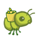
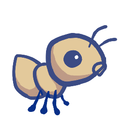

Project 3: Ants Vs. SomeBees
============================

> The bees are coming!  
> Create a better soldier  
> With inherit-ants.

Introduction[​](https://www.learncs.site/docs/curriculum-resource/cs61a/project/ants#introduction "Direct link to Introduction")
--------------------------------------------------------------------------------------------------------------------------------

> **For full credit:**
> 
> *   Submit with Phase 1 complete by **Thursday, March 7** (worth 1 pt).
> *   Submit with Phase 2 complete by **Tuesday, March 12** (worth 1 pt).
> *   Submit with all phases complete by **Tuesday, March 19**.
> 
> Solve the problems in order, since some later problems depend on earlier problems.
> 
> The entire project can be completed with a partner.
> 
> You can get 1 bonus point by submitting the entire project by **Monday, March 18**.

In this project, you will create a [tower defense](https://secure.wikimedia.org/wikipedia/en/wiki/Tower_defense) game called Ants Vs. SomeBees. As the ant queen, you populate your colony with the bravest ants you can muster. Your ants must protect their queen from the evil bees that invade your territory. Irritate the bees enough by throwing leaves at them, and they will be vanquished. Fail to pester the airborne intruders adequately, and your queen will succumb to the bees' wrath. This game is inspired by PopCap Games' [Plants Vs. Zombies](https://www.ea.com/studios/popcap/plants-vs-zombies).

This project uses an object-oriented programming paradigm, focusing on material from [Chapter 2.5](https://www.composingprograms.com/pages/25-object-oriented-programming.html) of Composing Programs. The project also involves understanding, extending, and testing a large program.

Download starter files[​](https://www.learncs.site/docs/curriculum-resource/cs61a/project/ants#download-starter-files "Direct link to Download starter files")
--------------------------------------------------------------------------------------------------------------------------------------------------------------

The [ants.zip](https://www.learncs.site/assets/files/ants-0ee8e4606134c99bd97f1e70cde0933d.zip) archive contains several files, but all of your changes will be made to `ants.py`.

*   `ants.py`: The game logic of Ants Vs. SomeBees
*   `ants_plans.py`: The details of each difficulty level
*   `ucb.py`: Utility functions for CS 61A
*   `gui.py:` A graphical user interface (GUI) for Ants Vs. SomeBees.
*   `ok`: The autograder
*   `proj3.ok`: The `ok` configuration file
*   `tests`: A directory of tests used by `ok`
*   `libs`: A directory of libraries used by `gui.py`
*   `static`: A directory of images and files used by `gui.py`
*   `templates`: A directory of HTML templates used by `gui.py`

Logistics[​](https://www.learncs.site/docs/curriculum-resource/cs61a/project/ants#logistics "Direct link to Logistics")
-----------------------------------------------------------------------------------------------------------------------

The project is worth 25 points. 23 points are for correctness, 1 point is for submitting Phase 1 by the first checkpoint date and 1 point is for submitting Phase 2 by the second checkpoint date.

You can get 1 EC point for submitting the entire project by **Monday, March 18**.

You will turn in the following files:

*   `ants.py`

You do not need to modify or turn in any other files to complete the project. To submit the project, **submit the required files to the appropriate Gradescope assignment.**

For the functions that we ask you to complete, there may be some initial code that we provide. If you would rather not use that code, feel free to delete it and start from scratch. You may also add new function definitions as you see fit.

**However, please do not modify any other functions or edit any files not listed above**. Doing so may result in your code failing our autograder tests. Also, please do not change any function signatures (names, argument order, or number of arguments).

Throughout this project, you should be testing the correctness of your code. It is good practice to test often, so that it is easy to isolate any problems. However, you should not be testing _too_ often, to allow yourself time to think through problems.

We have provided an **autograder** called `ok` to help you with testing your code and tracking your progress. The first time you run the autograder, you will be asked to **log in with your Ok account using your web browser**. Please do so. Each time you run `ok`, it will back up your work and progress on our servers.

The primary purpose of `ok` is to test your implementations.

If you want to test your code interactively, you can run

     python3 ok -q [question number] -i 

with the appropriate question number (e.g. `01`) inserted. This will run the tests for that question until the first one you failed, then give you a chance to test the functions you wrote interactively.

You can also use the debugging print feature in OK by writing

     print("DEBUG:", x) 

which will produce an output in your terminal without causing OK tests to fail with extra output.

The Game[​](https://www.learncs.site/docs/curriculum-resource/cs61a/project/ants#the-game "Direct link to The Game")
--------------------------------------------------------------------------------------------------------------------

A game of Ants Vs. SomeBees consists of a series of turns. In each turn, new bees may enter the ant colony. Then, new ants are placed to defend their colony. Finally, all insects (ants, then bees) take individual actions. Bees either try to move toward the end of the tunnel or sting ants in their way. Ants perform a different action depending on their type, such as collecting more food or throwing leaves at the bees. The game ends either when a bee reaches the end of the tunnel (ants lose), the bees destroy a `QueenAnt` if it exists (ants lose), or the entire bee fleet has been vanquished (ants win).

### Core concepts[​](https://www.learncs.site/docs/curriculum-resource/cs61a/project/ants#core-concepts "Direct link to Core concepts")

**The Colony**. This is where the game takes place. The colony consists of several `Place`s that are chained together to form tunnels through which the bees travel. The colony also has some quantity of food which can be expended in order to place an ant in a tunnel.

**Places**. A place links to another place to form a tunnel. The player can put a single ant into each place. However, there can be many bees in a single place.

**The Hive**. This is the place where bees originate. Bees exit the beehive to enter the ant colony.

**Ants**. The player places an ant into the colony by selecting from the available ant types at the top of the screen. Each type of ant takes a different action and requires a different amount of colony food to place. The two most basic ant types are the `HarvesterAnt`, which adds one food to the colony during each turn, and the `ThrowerAnt`, which throws a leaf at a bee each turn. You will be implementing many more!

**Bees**. Each turn, a bee either advances to the next place in the tunnel if no ant is in its way, or it stings the ant in its way. Bees win when at least one bee reaches the end of a tunnel. In addition to the orange bees, there are yellow wasps that do double damage and a green boss bee that is quite difficult to vanquish.

### Core classes[​](https://www.learncs.site/docs/curriculum-resource/cs61a/project/ants#core-classes "Direct link to Core classes")

The concepts described above each have a corresponding class that encapsulates the logic for that concept. Here is a summary of the main classes involved in this game:

*   **`GameState`**: Represents the colony and some state information about the game, including how much food is available, how much time has elapsed, where the `AntHomeBase` is, and all the `Place`s in the game.
*   **`Place`**: Represents a single place that holds insects. At most one `Ant` can be in a single place, but there can be many `Bee`s in a single place. `Place` objects have an `exit` to the left and an `entrance` to the right, which are also places. Bees travel through a tunnel by moving to a `Place`'s `exit`.
*   **`Hive`**: Represents the place where `Bee`s start out (on the right of the tunnel).
*   **`AntHomeBase`**: Represents the place `Ant`s are defending (on the left of the tunnel). If `Bee`s get here, they win :(
*   **`Insect`**: A base class for `Ant` and `Bee`. Each insect has a `health` attribute representing its remaining health and a `place` attribute representing the `Place` where it is currently located. Each turn, every active `Insect` in the game performs its `action`.
*   **`Ant`**: Represents ants. Each `Ant` subclass has special attributes or a special `action` that distinguish it from other `Ant` types. For example, a `HarvesterAnt` gets food for the colony and a `ThrowerAnt` attacks `Bee`s. Each ant type also has a `food_cost` attribute that indicates how much it costs to deploy one unit of that type of ant.
*   **`Bee`**: Represents bees. Each turn, a bee either moves to the `exit` of its current `Place` if the `Place` is not `blocked` by an ant, or stings the ant occupying its same `Place`.

### Game Layout[​](https://www.learncs.site/docs/curriculum-resource/cs61a/project/ants#game-layout "Direct link to Game Layout")

Below is a visualization of a GameState.

To help visualize how all the classes fit together, [here](https://www.learncs.site/assets/files/ants_diagram-2c04eda6fa437f165e3fbc8dbc5f3739.pdf) is a diagram of all of the classes and their inheritance relationships.

Getting Started Videos[​](https://www.learncs.site/docs/curriculum-resource/cs61a/project/ants#getting-started-videos "Direct link to Getting Started Videos")
--------------------------------------------------------------------------------------------------------------------------------------------------------------

These videos may provide some helpful direction for tackling the coding problems on the project.

> To see these videos, you should be logged into your berkeley.edu email.

[YouTube link](https://youtu.be/playlist?list=PLx38hZJ5RLZesYEQSFs0OpFiVC2kJcF_N)

Phase 1: Basic gameplay[​](https://www.learncs.site/docs/curriculum-resource/cs61a/project/ants#phase-1-basic-gameplay "Direct link to Phase 1: Basic gameplay")
----------------------------------------------------------------------------------------------------------------------------------------------------------------

> **For full credit:** submit with Phase 1 complete by **Thursday, March 7** (worth 1 pt).

In the first phase you will complete the implementation that will allow for basic gameplay with the two basic `Ant`s: the `HarvesterAnt` and the `ThrowerAnt`.

### Problem 0 (0 pt)[​](https://www.learncs.site/docs/curriculum-resource/cs61a/project/ants#problem-0-0-pt "Direct link to Problem 0 (0 pt)")

Answer a set of conceptual questions after you have read the _entire_ `ants.py` file by running this `ok` command:

    python3 ok -q 00 -u

If you get stuck while answering these questions, you can try reading through `ants.py` again or asking questions on Ed.

> **A note on unlocking tests**: If you'd like to review the unlocking questions after you have completed the unlocking test, you can navigate to (within the `ants` folder), the `tests` folder. For example, after unlocking Problem 0, you can review the unlocking test at `tests/00.py`.

### Problem 1 (1 pt)[​](https://www.learncs.site/docs/curriculum-resource/cs61a/project/ants#problem-1-1-pt "Direct link to Problem 1 (1 pt)")

**Part A**: Currently, there is no cost for placing any type of `Ant`, and so there is no challenge to the game. The base class `Ant` has a `food_cost` of zero. Override this class attribute for `HarvesterAnt` and `ThrowerAnt` according to the "Food Cost" column in the table below.
|Class|	Food Cost|	Initial Health|
|---  |---       |---             |
|HarvesterAnt | 2 |	 1 |
|  ThrowerAnt |  3  |	1 |

**Part B**: Now that placing an `Ant` costs food, we need to be able to gather more food! To fix this issue, implement the `HarvesterAnt` class. A `HarvesterAnt` is a type of `Ant` that adds one food to the `gamestate.food` total as its `action`.

Before writing any code, unlock the tests to verify your understanding of the question:

    python3 ok -q 01 -u

Once you are done unlocking, begin implementing your solution. You can check your correctness with:

    python3 ok -q 01

### Problem 2 (1 pt)[​](https://www.learncs.site/docs/curriculum-resource/cs61a/project/ants#problem-2-1-pt "Direct link to Problem 2 (1 pt)")

In this problem, you'll complete `Place.__init__` by adding code that tracks entrances. Right now, a `Place` keeps track only of its `exit`. We would like a `Place` to keep track of its entrance as well. A `Place` needs to track only one `entrance`. Tracking entrances will be useful when an `Ant` needs to see what `Bee`s are in front of it in the tunnel.

However, simply passing an entrance to a `Place` constructor will be problematic; we would need to have both the exit and the entrance before creating a `Place`! (It's a [chicken or the egg](https://en.wikipedia.org/wiki/Chicken_or_the_egg) problem.) To get around this problem, we will keep track of entrances in the following way instead. `Place.__init__` should use this logic:

*   A newly created `Place` always starts with its `entrance` as `None`.
*   If the `Place` has an `exit`, then the `exit`'s `entrance` is set to that `Place`.

> _Hint:_ Remember that when the `__init__` method is called, the first parameter, `self`, is bound to the newly created object

> _Hint:_ Try drawing out two `Place`s next to each other if things get confusing. In the GUI, a place's `entrance` is to its right while the `exit` is to its left.

> _Hint:_ Remember that `Place`s are not stored in a list, so you can't index into anything to access them. This means that you **can't** do something like `colony[index + 1]` to access an adjacent `Place`. How _can_ you move from one place to another?

Before writing any code, unlock the tests to verify your understanding of the question:

    python3 ok -q 02 -u

Once you are done unlocking, begin implementing your solution. You can check your correctness with:

    python3 ok -q 02

### Problem 3 (2 pt)[​](https://www.learncs.site/docs/curriculum-resource/cs61a/project/ants#problem-3-2-pt "Direct link to Problem 3 (2 pt)")

In order for a `ThrowerAnt` to throw a leaf, it must know which bee to hit. The provided implementation of the `nearest_bee` method in the `ThrowerAnt` class only allows them to hit bees in the same `Place`. Your job is to fix it so that a `ThrowerAnt` will `throw_at` the nearest bee in front of it **that is not still in the `Hive`.** This includes bees that are in the same `Place` as a `ThrowerAnt`

> _Hint:_ All `Place`s have an `is_hive` attribute which is `True` when that place is the `Hive`.

Change `nearest_bee` so that it returns a random `Bee` from the nearest place that contains bees. Your implementation should follow this logic:

*   Start from the current `Place` of the `ThrowerAnt`.
*   For each place, return a random bee if there is any, and if not, inspect the place in front of it (stored as the current place's `entrance`).
*   If there is no bee to attack, return `None`.

> _Hint_: The `random_bee` function provided in `ants.py` returns a random bee from a list of bees or `None` if the list is empty.

> _Hint_: As a reminder, if there are no bees present at a `Place`, then the `bees` attribute of that `Place` instance will be an empty list.

> _Hint_: Having trouble visualizing the test cases? Try drawing them out on paper! The sample diagram provided in [Game Layout](https://www.learncs.site/docs/curriculum-resource/cs61a/project/ants#game-layout) shows the first test case for this problem.

Before writing any code, unlock the tests to verify your understanding of the question:

    python3 ok -q 03 -u

Once you are done unlocking, begin implementing your solution. You can check your correctness with:

    python3 ok -q 03

### Playing the game[​](https://www.learncs.site/docs/curriculum-resource/cs61a/project/ants#playing-the-game "Direct link to Playing the game")

After implementing `nearest_bee`, a `ThrowerAnt` should be able to `throw_at` a `Bee` in front of it that is not still in the `Hive`.

Now you're ready to try what you've built. To start a graphical game, run:

    python3 gui.py

After you start the graphical version, the game is (usually) available at [http://127.0.0.1:31415/](http://127.0.0.1:31415/).

The game has several options that you will use throughout the project, which you can view with `python3 gui.py --help`.

    usage: gui.py [-h] [-d DIFFICULTY] [-w] [--food FOOD]Play Ants vs. SomeBeesoptional arguments:  -h, --help     show this help message and exit  -d DIFFICULTY  sets difficulty of game (test/easy/normal/hard/extra-hard)  -w, --water    loads a full layout with water  --food FOOD    number of food to start with when testing

You can refresh the webpage to restart the game, but if you changed your code, you need to terminate `gui.py` and run it again. To terminate `gui.py`, you can hit `Ctrl + C` on the terminal.

You cannot have multiple tabs of this same Ants GUI open simultaneously or they will all error.

### Submit your Phase 1 checkpoint[​](https://www.learncs.site/docs/curriculum-resource/cs61a/project/ants#submit-your-phase-1-checkpoint "Direct link to Submit your Phase 1 checkpoint")

Check to make sure that you completed all the problems in Phase 1:

    python3 ok --score

Then, submit `ants.py` to the **Ants Checkpoint 1** assignment on **Gradescope** before the checkpoint deadline.

When you run `ok` commands, you'll still see that some tests are locked because you haven't completed the whole project yet. You'll get full credit for the checkpoint if you complete all the problems up to this point.

Congratulations! You have finished Phase 1 of this project!

Phase 2: More Ants
---------------------------------------------------------------------------------------------------------------------------------------------------

> **For full credit:** submit with Phase 2 complete by **Tuesday, March 12** (worth 1 pt).

Now that you've implemented basic gameplay with two types of `Ant`s, let's add some flavor to the ways ants can attack bees. In this problem and on, you'll be implementing several different `Ant`s with different attack strategies.

**After you implement each `Ant` subclass in these sections, you'll need to set its `implemented` class attribute to `True`** so that that type of ant will show up in the GUI. Feel free to try out the game with each new ant to test the functionality!

With all following ants from now on, try `python3 gui.py` to play against a full swarm of bees in a multi-tunnel layout and try `-d hard` or `-d extra-hard` if you want a real challenge! If the bees are too numerous to vanquish, you might need to create some new ants.

### Problem 4 (2 pt)[​](https://www.learncs.site/docs/curriculum-resource/cs61a/project/ants#problem-4-2-pt "Direct link to Problem 4 (2 pt)")

A `ThrowerAnt` is a powerful threat to the bees, but it has a high food cost. In this problem, you'll implement two subclasses of `ThrowerAnt` that are less costly but have constraints on the distance they can throw:

*   The `LongThrower` can only `throw_at` a `Bee` that is found after following at least 5 `entrance` transitions. It cannot hit `Bee`s that are in the same `Place` as it or the first 4 `Place`s in front of it. If there are two `Bee`s, one too close to the `LongThrower` and the other within its range, the `LongThrower` should only throw at the farther `Bee`, which is within its range, instead of trying to hit the closer `Bee`.
*   The `ShortThrower` can only `throw_at` a `Bee` that is found after following at most 3 `entrance` transitions. It cannot throw at any bees further than 3 `Place`s in front of it.

Neither of these specialized throwers can `throw_at` a `Bee` that is exactly 4 `Place`s away.
|Class|	Food Cost	|Initial Health|
|---|---|---|
|ShortThrower|2|	1|
|LongThrower|2|	1|

To implement these new throwing ants, your `ShortThrower` and `LongThrower` classes should inherit the `nearest_bee` method from the base `ThrowerAnt` class. The logic of choosing which bee a thrower ant will attack is the same, except the `ShortThrower` and `LongThrower` ants where their range is limited by a lower and upper bound, respectively.

To do this, modify the `nearest_bee` method to reference `lower_bound` and `upper_bound` attributes, and only return a bee if it is within range.

Make sure to give these `lower_bound` and `upper_bound` attributes appropriate values in the `ThrowerAnt` class so that the behavior of `ThrowerAnt` is unchanged. Then, implement the subclasses `LongThrower` and `ShortThrower` with appropriately constrained ranges.

You should **not** need to repeat any code between `ThrowerAnt`, `ShortThrower`, and `LongThrower`.

> _Hint:_ `float('inf')` returns an infinite positive value represented as a float that can be compared with other numbers.

> _Hint:_ `lower_bound` and `upper_bound` should mark an inclusive range.

> **Important:** Make sure your class attributes are called `upper_bound` and `lower_bound` The tests directly reference these attribute names, and will error if you use another name for these attributes.

Don't forget to set the `implemented` class attribute of `LongThrower` and `ShortThrower` to `True`.

Before writing any code, unlock the tests to verify your understanding of the question:

    python3 ok -q 04 -u

After writing code, test your implementation (rerun the tests for 03 to make sure they still work):

    python3 ok -q 03

    python3 ok -q 04

👩🏽‍💻👨🏿‍💻 [Pair programming?](https://cs61a.org/articles/pair-programming) Remember to alternate between driver and navigator roles. The driver controls the keyboard; the navigator watches, asks questions, and suggests ideas.

### Problem 5 (3 pt)[​](https://www.learncs.site/docs/curriculum-resource/cs61a/project/ants#problem-5-3-pt "Direct link to Problem 5 (3 pt)")

Implement the `FireAnt`, which does damage when it receives damage. Specifically, if it is damaged by `amount` health units, it does a damage of `amount` to all bees in its place (this is called _reflected damage_). If it dies, it does an additional amount of damage, as specified by its `damage` attribute, which has a default value of `3` as defined in the `FireAnt` class.

To implement this, override `Insect`'s `reduce_health` method. Your overriden method should call the `reduce_health` method inherited from the superclass (`Ant`) _which inherits from it's superclass Insect_ to reduce the current `FireAnt` instance's health. Calling the _inherited_ `reduce_health` method on a `FireAnt` instance reduces the insect's `health` by the given `amount` and removes the insect from its place if its `health` reaches zero or lower.

> _Hint:_ Do _not_ call `self.reduce_health`, or you'll end up stuck in a recursive loop. (Can you see why?)

However, your method needs to also include the reflective damage logic:

*   Determine the reflective damage amount: start with the `amount` inflicted on the ant, and then add `damage` if the ant's health has dropped to or below 0.
*   For each bee in the place, damage them with the total amount by calling the appropriate `reduce_health` method for each bee.

> **Important:** Remember that when any `Ant` loses all its health, it is removed from its `place`, so pay careful attention to the order of your logic in `reduce_health`.

|**Class**|**Food Cost**|**Initial Health**|
|---|---|---|
|  `FireAnt`|5|3|

> _Hint:_ Damaging a bee may cause it to be removed from its place. If you iterate over a list, but change the contents of that list at the same time, you [may not visit all the elements](https://docs.python.org/3/tutorial/controlflow.html#for-statements). This can be prevented by making a copy of the list. You can either use a list slice, or use the built-in `list` function to make sure we do not affect the original list.

    >>> s = [1,2,3,4]>>> s[:][1, 2, 3, 4]>>> list(s)[1, 2, 3, 4]>>> (s[:] is not s) and (list(s) is not s)True

Once you've finished implementing the `FireAnt`, give it a class attribute `implemented` with the value `True`.

> _Note:_ Even though you are overriding the superclass's `reduce_health` function (`Ant.reduce_health`), you can still use this method in your implementation by calling it.

Before writing any code, unlock the tests to verify your understanding of the question:

    python3 ok -q 05 -u

Once you are done unlocking, begin implementing your solution. You can check your correctness with:

    python3 ok -q 05

You can also test your program by playing a game or two! A `FireAnt` should destroy all co-located `Bee`s when it is stung. To start a game with ten food (for easy testing):

    python3 gui.py --food 10

### Problem 6 (1 pt)[​](https://www.learncs.site/docs/curriculum-resource/cs61a/project/ants#problem-6-1-pt "Direct link to Problem 6 (1 pt)")

We are going to add some protection to our glorious home base by implementing the `WallAnt`, an ant that does nothing each turn. A `WallAnt` is useful because it has a large `health` value.

|**Class**|**Food Cost**|**Initial Health**|
|---|---|---|
|`WallAnt`  |4|4|

Unlike with previous ants, we have not provided you with a class statement. Implement the `WallAnt` class from scratch. Give it a class attribute `name` with the value `'Wall'` (so that the graphics work) and a class attribute `implemented` with the value `True` (so that you can use it in a game).

> _Hint_: Make sure you implement the `__init__` method too so the `WallAnt` starts off with the appropriate amount of `health`!

Before writing any code, unlock the tests to verify your understanding of the question:

    python3 ok -q 06 -u

Once you are done unlocking, begin implementing your solution. You can check your correctness with:

    python3 ok -q 06

### Problem 7 (3 pt)[​](https://www.learncs.site/docs/curriculum-resource/cs61a/project/ants#problem-7-3-pt "Direct link to Problem 7 (3 pt)")

Implement the `HungryAnt`, which will select a random `Bee` from its `place` and deal damage to the `Bee` equal to the `Bee`'s health, eating it whole. After eating a `Bee`, a `HungryAnt` must spend 3 turns chewing before being able to eat again. While the `HungryAnt` is chewing, it is not able to eat (deal damage to) any `Bee`s. If there is no bee in its place available to eat, the `HungryAnt` will do nothing.

We have not provided you with a class header. Implement the `HungryAnt` class from scratch. Give it a class attribute `name` with the value `'Hungry'` (so that the graphics work) and a class attribute `implemented` with the value `True` (so that you can use it in a game).

> _Hint:_ When a `Bee` is eaten, its health should be reduced by its health.

|**Class**|**Food Cost**|**Initial Health**|
|---|---|---|
|  `HungryAnt`|4|1|

Give `HungryAnt` a `chewing_turns` **class** attribute that stores the number of turns that it will take a `HungryAnt` to chew (set to 3). Also, give each `HungryAnt` an **instance** attribute `turns_to_chew` that counts the number of turns it has left to chew, initialized to 0, since it hasn't eaten anything at the beginning. You can also think of `turns_to_chew` as the number of turns until a `HungryAnt` can eat another `Bee`.

Implement the `action` method of the `HungryAnt`: First, check if it is chewing; if so, decrement its `turns_to_chew`. Otherwise, eat a random `Bee` in its `place` by reducing the `Bee`'s health to 0. Make sure to set the `turns_to_chew` when a `Bee` is eaten!

> _Hint_: Other than the `action` method, make sure you implement the `__init__` method too in order to define any instance variables and make sure that `HungryAnt` starts off with the appropriate amount of `health`!

Before writing any code, unlock the tests to verify your understanding of the question:

    python3 ok -q 07 -u

Once you are done unlocking, begin implementing your solution. You can check your correctness with:

    python3 ok -q 07

👩🏽‍💻👨🏿‍💻 [Pair programming?](https://cs61a.org/articles/pair-programming) This would be a good time to switch roles. Switching roles makes sure that you both benefit from the learning experience of being in each role.

### Problem 8 (3 pt)[​](https://www.learncs.site/docs/curriculum-resource/cs61a/project/ants#problem-8-3-pt "Direct link to Problem 8 (3 pt)")

Right now, our ants are quite frail. We'd like to provide a way to help them last longer against the onslaught of the bees. Enter the `BodyguardAnt`.

|**Class**|**Food Cost**|**Initial Health**|
|---|---|---|
|`BodyguardAnt`|4|2|

To implement the `BodyguardAnt`, we will break up this problem into 3 subparts. In each part, we will making changes in either the `ContainerAnt` class, `Ant` class, or `BodyguardAnt` class.

> _Note:_ We have separated out Question 8 into three different subparts. We recommend going through the unlocking test for each subpart before writing any code for it. You will be tested through each subpart and each subpart is worth one point (for a total of three for the whole question).

#### Problem 8a[​](https://www.learncs.site/docs/curriculum-resource/cs61a/project/ants#problem-8a "Direct link to Problem 8a")

A `BodyguardAnt` differs from a normal ant because it is a `ContainerAnt`; it can contain another ant and protect it, all in one `Place`. When a `Bee` stings the ant in a `Place` where one ant contains another, only the container is damaged. The ant inside the container can still perform its original action. If the container perishes, the contained ant still remains in the place (and can then be damaged).

Each `ContainerAnt` has an instance attribute `ant_contained` that stores the ant it contains. This ant, `ant_contained`, initially starts off as `None` to indicate that there is no ant being stored yet. Implement the `store_ant` method so that it sets the `ContainerAnt`'s `ant_contained` instance attribute to the passed in `ant` argument. Also implement the `ContainerAnt`'s `action` method to perform its `ant_contained`'s action if it is currently containing an ant.

In addition, to ensure that a container and its contained ant can both occupy a place at the same time (a maximum of two ants per place), but only if exactly one is a container, we can create an `can_contain` method.

There is already an `Ant.can_contain` method, but it always returns `False`. Override the method `ContainerAnt.can_contain` so that it takes an ant `other` as an argument and returns `True` if:

*   This `ContainerAnt` does not already contain another ant.
*   The other ant is not a container.

> _Hint:_ You may find the `is_container` attribute that each `Ant` has useful for checking if a specific `Ant` is a container.

Before writing any code, unlock the tests to verify your understanding of the question:

    python3 ok -q 08a -u

Once you are done unlocking, begin implementing your solution. You can check your correctness with:

    python3 ok -q 08a

#### Problem 8b[​](https://www.learncs.site/docs/curriculum-resource/cs61a/project/ants#problem-8b "Direct link to Problem 8b")

Modify `Ant.add_to` to allow a container and a non-container ant to occupy the same place according to the following rules:

*   If the ant originally occupying a place can contain the ant being added, then both ants occupy the place and original ant contains the ant being added.
*   If the ant being added can contain the ant originally in the space, then both ants occupy the place and the (container) ant being added contains the original ant.
*   If neither `Ant` can contain the other, raise the same `AssertionError` as before (the one already present in the starter code).
*   **Important:** If there are two ants in a specific `Place`, the `ant` attribute of the `Place` instance should refer to the container ant, and the container ant should contain the non-container ant.

> _Hint_: You should also take advantage of the `can_contain` method you wrote and avoid repeating code.

> **Note:** If you're getting an "unreachable code" warning for `Ant.add_to` via the VSCode Pylance extension, it's fine to ignore this specific warning, as the code is actually run (the warning _in this case_ is inaccurate).

Before writing any code, unlock the tests to verify your understanding of the question:

    python3 ok -q 08b -u

Once you are done unlocking, begin implementing your solution. You can check your correctness with:

    python3 ok -q 08b

#### Problem 8c[​](https://www.learncs.site/docs/curriculum-resource/cs61a/project/ants#problem-8c "Direct link to Problem 8c")

Add a `BodyguardAnt.__init__` that sets the initial amount of health for the ant. We do not need to create an `action` method here since the `BodyguardAnt` class inherits it from the `ContainerAnt` class. Also note that the `BodyguardAnt` does not do any damage.

Once you've finished implementing the `BodyguardAnt`, give it a class attribute `implemented` with the value `True`.

Before writing any code, unlock the tests to verify your understanding of the question:

    python3 ok -q 08c -u

Once you are done unlocking, begin implementing your solution. You can check your correctness with:

    python3 ok -q 08c

### Problem 9 (2 pt)[​](https://www.learncs.site/docs/curriculum-resource/cs61a/project/ants#problem-9-2-pt "Direct link to Problem 9 (2 pt)")

The `BodyguardAnt` provides great defense, but they say the best defense is a good offense. The `TankAnt` is a `ContainerAnt` that protects an ant in its place and also deals 1 damage to all bees in its place each turn. Like any `ContainerAnt`, a `TankAnt` allows the ant that it contains to perform its action each turn.

|**Class**|**Food Cost**|**Initial Health**|
|---|---|---|
| `TankAnt`|6|2|

We have not provided you with a class header. Implement the `TankAnt` class from scratch. Give it a class attribute `name` with the value `'Tank'` (so that the graphics work) and a class attribute `implemented` with the value `True` (so that you can use it in a game).

You should not need to modify any code outside of the `TankAnt` class. If you find yourself needing to make changes elsewhere, look for a way to write your code for the previous question such that it applies not just to `BodyguardAnt` and `TankAnt` objects, but to container ants in general.

> _Hint_: The only methods you need to override from `TankAnt`'s parent class are `__init__` and `action`.

> _Hint_: Like with `FireAnt`, it is possible that damaging a bee will cause it to be removed from its place.

Before writing any code, unlock the tests to verify your understanding of the question:

    python3 ok -q 09 -u

Once you are done unlocking, begin implementing your solution. You can check your correctness with:

    python3 ok -q 09

**Submit your Phase 2 checkpoint**

Check to make sure that you completed all the problems in Phase 2:

    python3 ok --score

Then, submit `ants.py` to the **Ants Checkpoint 2** assignment on **Gradescope** before the checkpoint deadline.

When you run `ok` commands, you'll still see that some tests are locked because you haven't completed the whole project yet. You'll get full credit for the checkpoint if you complete all the problems up to this point.

Congratulations! You have finished Phase 2 of this project!

Phase 3: Water and Might[​](https://www.learncs.site/docs/curriculum-resource/cs61a/project/ants#phase-3-water-and-might "Direct link to Phase 3: Water and Might")
-------------------------------------------------------------------------------------------------------------------------------------------------------------------

In the final phase, you're going to add one last kick to the game by introducing a new type of place and new ants that are able to occupy this place. One of these ants is the most important ant of them all: the queen of the colony!

### Problem 10 (1 pt)[​](https://www.learncs.site/docs/curriculum-resource/cs61a/project/ants#problem-10-1-pt "Direct link to Problem 10 (1 pt)")

Let's add water to the colony! Currently there are only two types of places, the `Hive` and a basic `Place`. To make things more interesting, we're going to create a new type of `Place` called `Water`.

Only an insect that is waterproof can be placed in `Water`. In order to determine whether an `Insect` is waterproof, add a new class attribute to the `Insect` class named `is_waterproof` that is set to `False`. Since bees can fly, their `is_waterproof` attribute is `True`, overriding the inherited value.

Now, implement the `add_insect` method for `Water`. First, add the insect to the place regardless of whether it is waterproof. Then, if the insect is not waterproof, reduce the insect's health to 0. _Do not repeat code from elsewhere in the program._ Instead, use methods that have already been defined.

Before writing any code, unlock the tests to verify your understanding of the question:

    python3 ok -q 10 -u

Once you are done unlocking, begin implementing your solution. You can check your correctness with:

    python3 ok -q 10

Once you've finished this problem, play a game that includes water. To access the `wet_layout`, which includes water, add the `--water` option (or `-w` for short) when you start the game.

    python3 gui.py --water

👩🏽‍💻👨🏿‍💻 [Pair programming?](https://cs61a.org/articles/pair-programming) Remember to alternate between driver and navigator roles. The driver controls the keyboard; the navigator watches, asks questions, and suggests ideas.

### Problem 11 (2 pt)[​](https://www.learncs.site/docs/curriculum-resource/cs61a/project/ants#problem-11-2-pt "Direct link to Problem 11 (2 pt)")

Currently there are no ants that can be placed on `Water`. Implement the `ScubaThrower`, which is a subclass of `ThrowerAnt` that is more costly and waterproof, _but otherwise identical to its base class_. A `ScubaThrower` should not lose its health when placed in `Water`.

|**Class**|**Food Cost**|**Initial Health**|
|---|---|---|
|  `ScubaThrower`|6|1|

We have not provided you with a class header. Implement the `ScubaThrower` class from scratch. Give it a class attribute `name` with the value `'Scuba'` (so that the graphics work) and remember to set the class attribute `implemented` with the value `True` (so that you can use it in a game).

Before writing any code, unlock the tests to verify your understanding of the question:

    python3 ok -q 11 -u

Once you are done unlocking, begin implementing your solution. You can check your correctness with:

    python3 ok -q 11

### Problem 12 (2 pt)[​](https://www.learncs.site/docs/curriculum-resource/cs61a/project/ants#problem-12-2-pt "Direct link to Problem 12 (2 pt)")

Finally, implement the `QueenAnt`. A queen is a `ThrowerAnt` that inspires her fellow ants through her bravery. In addition to the standard `ThrowerAnt` action, a `QueenAnt` doubles the damage of all the ants behind her each time she performs an action. Once an ant's damage has been doubled, it _cannot_ be doubled again.

> Note: The reflected damage of a `FireAnt` should not be doubled, only the extra damage it deals when its health is reduced to 0.

|**Class**|**Food Cost**|**Initial Health**|
|---|---|---|
|  `QueenAnt`|7|1|

However, with great power comes great responsibility. If a queen ever has its health reduced to 0, the ants lose. You will need to override `Insect.reduce_health` in `QueenAnt` and call `ants_lose()` in that case in order to signal to the simulator that the game is over. (The ants also still lose if any bee reaches the end of a tunnel.)

> _Hint:_ For doubling the damage of all ants behind her, you may fill out the `double` method defined in the `Ant` class, then call it from the `QueenAnt` class. To avoid doubling an ant's damage twice, mark the ants that have been double damaged in a way that persists across calls to `QueenAnt.action`.

> _Hint:_ When doubling the ants' damage, keep in mind that there can be more than one ant in a `Place`, such as if one ant is guarding another.

> _Hint:_ Remember that QueenAnt's `reduce_health` method adds the additional task of calling `ants_lose` to the superclass's `reduce_health` method. How can we make sure we still do everything from the superclass's method without repeating code?

> _Hint:_ You can find each `Place` in a tunnel behind a `QueenAnt` by starting at the ant's `place.exit` and then repeatedly following its `exit`. The `exit` of a `Place` at the end of a tunnel is `None`.

Before writing any code, unlock the tests to verify your understanding of the question:

    python3 ok -q 12 -u

Once you are done unlocking, begin implementing your solution. You can check your correctness with:

    python3 ok -q 12

Optional Problems[​](https://www.learncs.site/docs/curriculum-resource/cs61a/project/ants#optional-problems "Direct link to Optional Problems")
-----------------------------------------------------------------------------------------------------------------------------------------------

### Optional Problem 1[​](https://www.learncs.site/docs/curriculum-resource/cs61a/project/ants#optional-problem-1 "Direct link to Optional Problem 1")

> During Office Hours and Project Parties, the staff will prioritize helping students with required questions. We will not be offering help with this question unless the [queue](https://oh.cs61a.org/) is empty.

Implement the `NinjaAnt`, which damages all `Bee`s that pass by, but can never be stung.

|**Class**|**Food Cost**|**Initial Health**|
|---|---|---|
|  `NinjaAnt`|5|1|

A `NinjaAnt` does not block the path of a `Bee` that flies by. To implement this behavior, first modify the `Ant` class to include a new class attribute `blocks_path` that is set to `True`, then override the value of `blocks_path` to `False` in the `NinjaAnt` class.

Second, modify the `Bee`'s method `blocked` to return `False` if either there is no `Ant` in the `Bee`'s `place` or if there is an `Ant`, but its `blocks_path` attribute is `False`. Now `Bee`s will just fly past `NinjaAnt`s.

Finally, we want to make the `NinjaAnt` damage all `Bee`s that fly past. Implement the `action` method in `NinjaAnt` to reduce the health of all `Bee`s in the same `place` as the `NinjaAnt` by its `damage` attribute. Similar to the `FireAnt`, you must iterate over a potentially changing list of bees.

> _Hint_: Having trouble visualizing the test cases? Try drawing them out on paper! See the example in [Game Layout](https://www.learncs.site/docs/curriculum-resource/cs61a/project/ants#game-layout) for help.

Before writing any code, unlock the tests to verify your understanding of the question:

    python3 ok -q optional1 -u

Once you are done unlocking, begin implementing your solution. You can check your correctness with:

    python3 ok -q optional1

For a challenge, try to win a game using only `HarvesterAnt` and `NinjaAnt`.

### Optional Problem 2[​](https://www.learncs.site/docs/curriculum-resource/cs61a/project/ants#optional-problem-2 "Direct link to Optional Problem 2")

> During Office Hours and Project Parties, the staff will prioritize helping students with required questions. We will not be offering help with this question unless the [queue](https://oh.cs61a.org/) is empty.

We've been developing this ant for a long time in secret. It's so dangerous that we had to lock it in the super hidden CS61A underground vault, but we finally think it is ready to go out on the field. In this problem, you'll be implementing the final ant -- `LaserAnt`, a `ThrowerAnt` with a twist.

|**Class**|**Food Cost**|**Initial Health**|
|---|---|---|
  `LaserAnt`|10|1|

The `LaserAnt` shoots out a powerful laser, damaging all that dare to stand in its path. Both `Bee`s and `Ant`s, of all types, are at risk of being damaged by `LaserAnt`. When a `LaserAnt` takes its action, it will damage all `Insect`s in its place (excluding itself, but including its container if it has one) and the `Place`s in front of it, excluding the `Hive`.

If that were it, `LaserAnt` would be too powerful for us to contain. The `LaserAnt` has a base damage of `2`. But, `LaserAnt`'s laser comes with some quirks. The laser is weakened by `0.25` each place it travels away from `LaserAnt`'s place. Additionally, `LaserAnt` has limited battery. Each time `LaserAnt` actually damages an `Insect` its laser's total damage goes down by `0.0625` (1/16). If `LaserAnt`'s damage becomes negative due to these restrictions, it simply does 0 damage instead.

> The exact order in which things are damaged within a turn is unspecified.

In order to complete the implementation of this ultimate ant, read through the `LaserAnt` class, set the class attributes appropriately, and implement the following two functions:

1.  `insects_in_front` is an instance method, called by the `action` method, that returns a dictionary where each key is an `Insect` and each corresponding value is the distance (in places) that that `Insect` is away from `LaserAnt`. The dictionary should include all `Insects` on the same place or in front of the `LaserAnt`, excluding `LaserAnt` itself.
2.  `calculate_damage` is an instance method that takes in `distance`, the distance that an insect is away from the `LaserAnt` instance. It returns the damage that the `LaserAnt` instance should afflict based on:
3.  The `distance` away from the `LaserAnt` instance that an `Insect` is.
4.  The number of `Insects` that this `LaserAnt` has damaged, stored in the `insects_shot` instance attribute.

In addition to implementing the methods above, you may need to modify, add, or use class or instance attributes in the `LaserAnt` class as needed.

> _Note:_ There are no unlocking tests for this question.

You can run the provided test, but it is not exhaustive:

    python3 ok -q optional2

Make sure to test your code!

Project submission[​](https://www.learncs.site/docs/curriculum-resource/cs61a/project/ants#project-submission "Direct link to Project submission")
--------------------------------------------------------------------------------------------------------------------------------------------------

Run `ok` on all problems to make sure all tests are unlocked and pass:

    python3 ok

You can also check your score on each part of the project:

    python3 ok --score

Once you are satisfied, submit this assignment by uploading `ants.py` to the **Ants** assignment on **Gradescope.** For a refresher on how to do this, refer to [Lab 00](https://cs61a.org/lab/lab00/#task-c-submitting-the-assignment).

You can add a partner to your Gradescope submission by clicking on **+ Add Group Member** under your name on the right hand side of your submission. Only one partner needs to submit to Gradescope.

**You are now done with the project!** If you haven't yet, you should try playing the game!

    python3 gui.py [-h] [-d DIFFICULTY] [-w] [--food FOOD]

**Acknowledgments:** Tom Magrino and Eric Tzeng developed this project with John DeNero. Jessica Wan contributed the original artwork. Joy Jeng and Mark Miyashita invented the queen ant. Many others have contributed to the project as well!

The new concept artwork was drawn by Alana Tran, Andrew Huang, Emilee Chen, Jessie Salas, Jingyi Li, Katherine Xu, Meena Vempaty, Michelle Chang, and Ryan Davis.